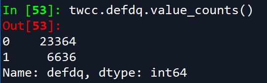
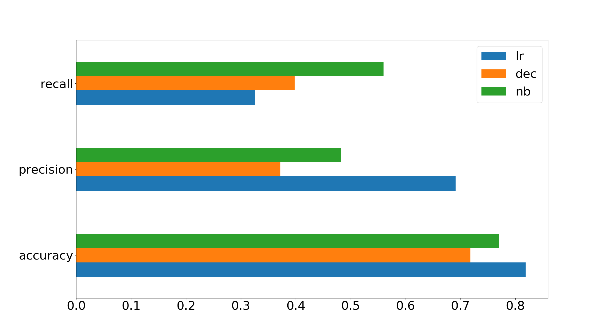
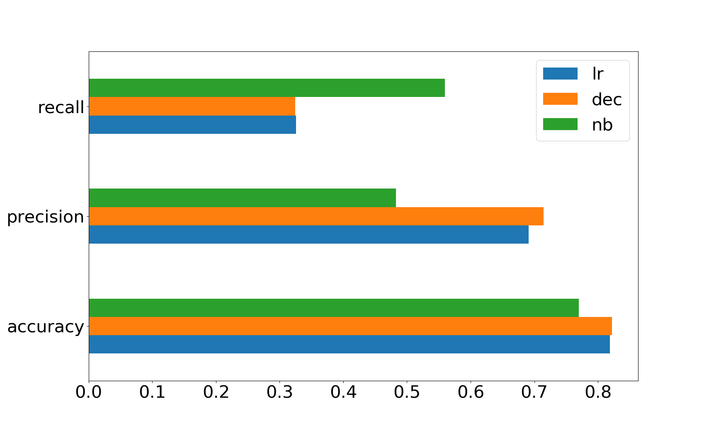
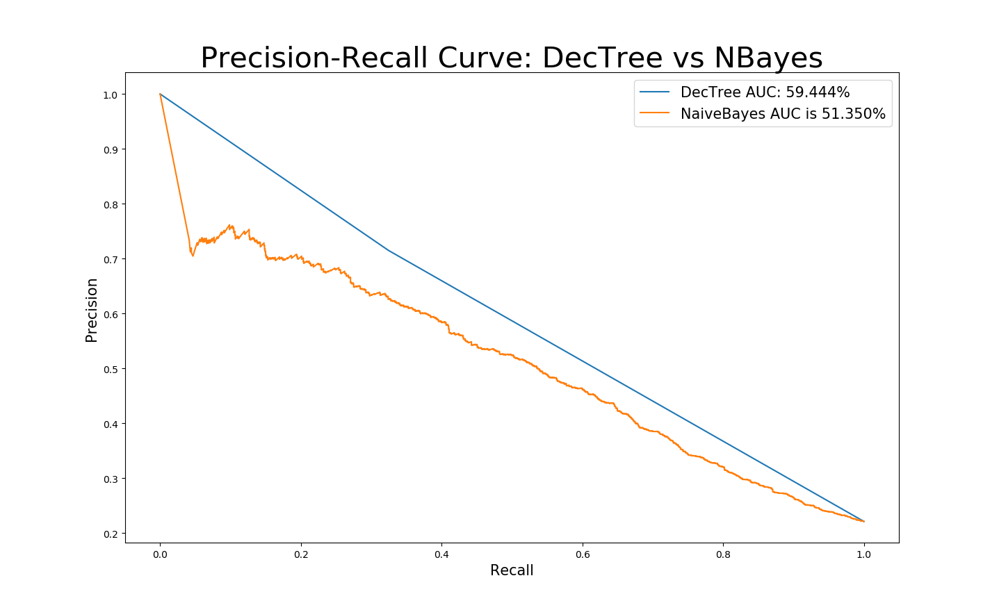

# Decision Tree and paramter tuning on Taiwan Credit Card Fraud 
Simple paramter tuning on Decision Tree. show difference vs. Logistic Regression & Naive Bayes 
Data Used: 
- Source: https://archive.ics.uci.edu/ml/datasets/default+of+credit+card+clients
- Time Period: April to September 2005
- 30k borrower outcomes, 24 features

Libraries used in this example include the following: 

```
import pandas as pd 
import numpy as np
from scipy import stats 
import os
import re
import matplotlib.pyplot as plt

from sklearn.model_selection import train_test_split as TTS
from sklearn.metrics import auc, accuracy_score, precision_score, recall_score, average_precision_score, roc_auc_score, confusion_matrix, precision_recall_curve
from sklearn.preprocessing import RobustScaler  #scales different variables to be comparable. 
from sklearn.linear_model import LinearRegression as LinReg, LogisticRegression as LogReg
from sklearn.tree import DecisionTreeClassifier as DecTree
from sklearn.naive_bayes import GaussianNB
from sklearn.cross_validation import cross_val_predict, cross_val_score, KFold 
```

After checking for null values and extreme outliers, we shorten the default name and one-hot encode the values for sex, education, and marriage. Using marriage as an example: 

```
twcc = pd.read_csv('UCI_Credit_Card.csv')
twcc.rename(columns={'default.payment.next.month':'defdq'}, inplace=True)
twcc['married'] = (twcc.MARRIAGE==1).astype('int')
```

A quick scan of the data shows the label/response variable for default is skewed about 75-25% in favor on non-default, which is very common. While this is actually a very high default rate, the response here is still considered imbalanced, which will have implications for how we measure the performance of our models. 



In addition to one-hot encoding, we scale the continuous variables through the 'RobustScaler' package from `sklearn.preprocessing`. For illustration purposes, we will run a simple train-test split. To further ensure the robustness of the model, we would use k-fold cross validation (packages included above). 

```
X = twcc.drop('defdq', axis=1)
Y = twcc.defdq
robscale = RobustScaler()
X = robscale.fit_transform(X)
x_train, x_test, y_train, y_test = TTS(X, Y, random_state=123, test_size=0.2, stratify=Y)
```

After fitting logistic regression, naive Bayes, and a decision tree on default parameters, we compare the accuracy results.

 

Here we can see logistic regression having the best accuracy and precision rates, while recall is highest under Naive Bayes. Options for tuning the the logistic regression and naive bayes are limited so we focus on tuning our Decision Tree model. 

The main parameters to adjust in the Decision Tree model are the minimum number of samples or observations required for a split (`min_samples_split`), the minimum number of samples on the resulting node after a split (`min_samples_leaf`), the maximum number of splits (`max_depth`), and the maximum number of fields used (`max_features`). Our goal is to select the best numbers to use for each parameter. Since the data is imbalanced, we are trying to maximize the area under the precision-recall curve (PRAUC). As an example, we run the below loop to tune the `min_samples_split`. 

```
ms_splits = np.linspace(0.01, 1, 100, endpoint=True); #array of values for min_sample_split parameter
prauc_vals = []
for ms in ms_splits:
    dec_mod = DecTree(min_samples_split=ms, random_state=10)
    dec_mod.fit(x_train, y_train) 
    precdec, recdec, threshdec = precision_recall_curve(y_true = y_test,
                                                   probas_pred = dec_mod.predict_proba(x_test)[:,1])
    prauc = auc(recdec,precdec) 
    prauc_vals.append([ms,prauc])

prauc_vals = pd.DataFrame(prauc_vals, columns=['ms_splits','prauc']) 
mss_maxprauc = prauc_vals.loc[prauc_vals['prauc']==prauc_vals.prauc.max(),'ms_splits'].values[0]
```

Graphing our PRAUC values against the number of splits yields, we see returns diminish as we increase the obsevations required for a split. 

 

We repeat this loop for the other three paramaters, store the best value for each, then re-run the Decision Tree again. 

```
dec_mod = DecTree(min_samples_split=mss_maxprauc,min_samples_leaf=msl_maxprauc,
                  max_depth=mxd_maxprauc,max_features=mxf_maxprauc, random_state=10) 
```
 This time the model well outperforms logistic regression and Naive Bayes. However, Naive Bayes still has better recall. 
 
 
 
We can also illustrate the stronger performance of the tuned model with a precision-recall curve. 


